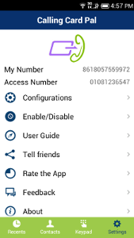
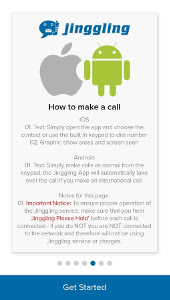
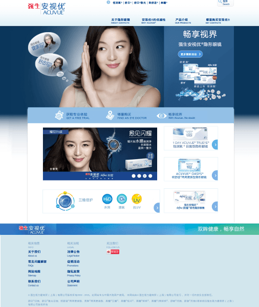

## 联系方式

- Email: lishujie911@gmail.com
- 电话：15925802104

---

## 个人信息

- 李坏/男/1988
- 硕士/杭州电子科技大学
- 工作年限：5年
- Github: [https://github.com/lihuaib](https://github.com/lihuaib)

---
## 工作经历及项目

> 离职原因：基于对产品的探索，希望做一款软件让更多人受益

### 易通软件科技有限公司 （2013年7月 ～ 2015年6月）

#### Ccpal 项目 [https://play.google.com/store/apps/details?id=com.netspectrum.ccpal](https://play.google.com/store/apps/details?id=com.netspectrum.ccpal)

- 技术语言： Java, PHP, bash， sql
- 框架： YII， SSH

> calling card pal (google play 可以下载)一个系列的国际电话辅助拨号软件， 与全球voip 供应商合作， 目地在于为全球拨打国际电话的用户提供更便宜的电话和语音服务.

>终端：我独立负责 android 的维护开发， UI 以及 net 优化，

>服务器 centos：产品部署， 负载监控， 以及相关维护和开发

>Voip 服务器： 目前选择freeswitch， 并且做相关部署和配置。

>团队职责： 负责整个团队进度的控制， 和产品的输出， 并针对市场客户的反应积极和合理调整产品功能

>在我接手该项目后，ccpal 的android用户 从原来的 2 w 提高到了目前的 7w， 并且在google中也得到平均 4星的好评

#### Jinggling 项目 [https://play.google.com/store/apps/details?id=com.netspectrum.Ezcall](https://play.google.com/store/apps/details?id=com.netspectrum.Ezcall)

> 该项目是 ccpal 的分支， 目地和 ccpal 的目地相同， 但是更主要的客户群体是英国客户， 并且集成了主流付款平台
> 依靠该项目的稳定客户群体， 和良好的防诈骗机制， 目前该项目能获得每个星期获取几千美元的收入

---

### 杭州感遇科技 （2012年5月 ～ 2013年7月）

#### 康熙德州扑克 项目

- 技术语言： C#， Java， IOS， SQL
- 框架： Photon， Unity， entityframework

> 该应用是纸牌类游戏， 沿用 “世界扑克大赛” 规则进行， 用来娱乐大众， 并且集成广告以及付款模块来获取利益。

> 服务器后台： 采用 photon， 我的职责是负责 “成就系统” 模块， 纸牌的相关算法和产出 和 多个photon 服务器之间的负载均衡， 用来防止用户在突然增长期所造成的服务器崩溃

> 统计后台： 主要用来分析用户的行为和渠道商的推广量， 里面包括多个用户特征： 下载量， 充值数， 在线时间， 游戏时间， 等等。从而挖掘游戏的亮点去吸引用户， 增加用户粘性等。

> android： 该部分是基于unity ， 采用 mono 平台， 采用C# 完成主要代码， 我的职责是游戏大厅的建立， 和建立状态机， 从而让游戏角色摆脱代码的耦合性， 从而采用简单的脚本就可以控制各种角色

---

### CI&T  （2010年12月 ～ 2012年4月）

#### 强生美瞳 项目 （网址： [http://www.acuvue.com.cn](http://www.acuvue.com.cn)）

- 技术语言： PHP， SQL
- 框架： drupal

> 该网站是 CMS 新闻类网站， 用于强生公司在美瞳项目在中国地区的宣传。

> 性能部分： 对首页以及新闻页面， 采用页面静态化技术，缓存网页到本地文件， 利用该缓存技术来加快页面的渲染。

> 模块部分： 集合第三方登陆 qq 和 sina

#### Inforest 内部网站
- 技术语言：C#， SQL
- 框架： SharePoint， MOSS

> 该网站是CMS新闻网站， 不过是对内部开放

> 数据部分： 个人职责是保证平台迁移，分析旧平台数据结构， 然后将2w多条数据从旧的oracle到新平台， 并且保证新平台网页显示结构完整。

> 安全部分： 个人职责是根据企业将近百个群组不同和权限， 引用权限机制，将不同 webpart 配置相应level

### 个人项目
> 在校内时期，为了解决企业的一些软件自动化问题， 个人也接了部分项目

- 技术语言：C#， SQL
- 框架： Sharpdevelop， XMPP

> 这应用是及时反映客户和牛奶供应状态，管理牛奶配送以满足客户定制牛奶需要, 以及满足整个区的牛奶每日的出库入库等大量信息

> 该项目是为了解决每天将近10w数量的牛奶（后台操作人员只有两个），为了保证效率和信息准确性而写。

> 应用前台：个人的职责 采用Sharpdevelop 为UI框架， 采用Command模式， 将各个独立逻辑做成addon， 来满足企业变化的需求。 在界面上， 借鉴vim 和 firefox 等一些快捷方式， 加快后台人员的输入输出。

> 数据后台：个人职责 根据城市的区域性不同， 采用webapi 的结构， 将不同区域分开， 从而降低服务器的负载

> 消息部分: 采用 xmpp 开源框架， 实现企业内部的消息传递。

---

####  技能清单

以下均为我熟练使用的技能

- Web开发：PHP/NET
- Web框架：Yii
- 数据库相关：MySQL/MSSQL
- 版本管理、文档和自动化部署工具：Svn/Git
- 云和开放平台：ALIYUN/AWS

语言
- JAVA
- C#
- PHP
- Python
- C/C++
- JS
