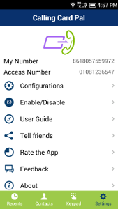
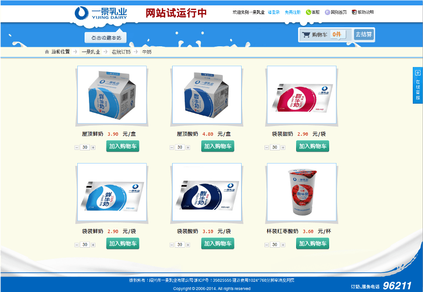

## 联系方式

- Email: lishujie911@gmail.com
- 电话：15925802104

---

## 个人信息

- 李坏/男/1988
- 工作年限：5年
- Github: https://github.com/lihuaib
- 期望职位：android
- 期望城市：杭州

---

## 专业技能

- 熟练使用 java(熟悉EventBus, okhttp, netty等框架), 熟悉python脚本语言; 
- 熟练掌握Java NIO网络编程; 
- 对异步、多进程以及高并发处理有较好的理解 
- 基础扎实,熟练掌握常用的数据结构、常用算法,设计模式; 
- 熟悉使用MySQL数据库; 
- 具有开源经验,发布多个开源项目到开源社区;

---

## 工作经历及项目

### 杭州小余小余教育科技有限公司 （2015年8月 ～ 至今）

#### 家有学霸 安卓端 [http://www.jiayouxueba.com/](https://play.google.com/store/apps/details?id=com.netspectrum.ccpal)

- 技术语言： Java, C, python 
- 框架：eventbus + retrofit + okhttp + 参考fackebook的flux的思想

> 团队组成大多数是来自阿里和网易的同学们

> 家有学霸是一款在线家教平台，目前功能有发单，抢单，1对1语音白板教学，1对多大教室语音视频白板教学
 
> 项目描述: 家有学霸帮助更多的人能以更实惠的价格获取更好的教育为宗旨，做线上教育，主要是k12, 针对消费人群是中小学生，产品是集成聊天，语音，白板，视频回放等功能，较为完整的体现了在线教育的体系

> 整个项目采用
    提供了 xylist 针对android list开发的开源组件 [xylist](https://github.com/lihuaib/xylist)
    通用的 自定义的日志模块 个人开源: xyLog https://github.com/lihuaib/xylog
    路由表来封装模块，避免隐式跳转被劫持

> 职责：
>>    1.项目主负责人
    2.参与需求讨论，负责设计架构，模块划分，并且开发和维护。
    3.事故原因分析，找出问题并且优化
    4.对所将要采用的开源框架的评估

---

### 易通软件科技有限公司 （2013年7月 ～ 2015年7月）

#### Ccpal 项目 [https://play.google.com/store/apps/details?id=com.netspectrum.ccpal](https://play.google.com/store/apps/details?id=com.netspectrum.ccpal)

- 技术语言： Java, PHP, bash， sql
- 框架： YII， SSH

> 团队的领导者是来自google 的研发工程师

> 项目描述:
    calling card pal (google play 可以下载)一个系列的国际电话辅助拨号软件， 与全球voip 供应商合作， 目地在于为全球拨打国际电话的用户提供更便宜的电话和语音服务.
> android 端项目采用:
    简化事件框架个人开源 JEvent https://github.com/lihuaib/jevent

> 职责: 
    1. 负责 android 的维护开发 以及 网络请求优化
    2. 业务服务器 部署， 负载监控， 以及相关维护和开发
    3. Voip 服务器： 目前选择freeswitch， 并且做相关部署和配置。
    4. 团队职责： 负责整个团队进度的控制， 和产品的输出， 并针对市场客户的反应积极和合理调整产品功能 

> 成果:
    在我接手该项目后，ccpal 的android用户 从原来的 2 w 提高到了目前的 7w， 并且在google中也得到平均 4星的好评

---

### 杭州感遇科技 （2012年5月 ～ 2012年10月）

#### 康熙德州扑克 项目

- 技术语言： C#， Java， IOS， SQL
- 框架： Photon， Unity， entityframework

> 团队组成一半多是来自腾讯和网龙的同学

> 该应用是纸牌类游戏， 沿用 “世界扑克大赛” 规则进行， 用来娱乐大众， 并且集成广告以及付款模块来获取利益。

> 职责： 
    1.服务器负载均衡的编写, 当时主要是通过心跳和限流和CPU 负载来计算
    2.纸牌相关算法的设计
    3.数据特征挖掘, 主要是为了市场的推广，和增加用户粘性等
    4.客户端“成就系统” 模块，该部分是基于unity ， 采用 mono 平台， 采用C# 完成主要代码， 我的职责是游戏大厅的建立， 和建立状态机， 从而让游戏角色摆脱代码的耦合性， 从而采用简单的脚本就可以控制各种角色

---

### CI&T  （2011年12月 ～ 2013年4月）

> 团队的技术人员以巴西人为主，并且领导者大多来自雅虎
> 项目以外包为主，主要是 sharepoint 和 drupal 的开发

#### 强生美瞳 项目 （网址： [http://www.acuvue.com.cn](http://www.acuvue.com.cn)）

- 技术语言： PHP， SQL
- 框架： drupal

> 该网站是 CMS 新闻类网站， 用于强生公司在美瞳项目在中国地区的宣传。

> 性能部分： 对首页以及新闻页面， 采用页面静态化技术，缓存网页到本地文件， 利用该缓存技术来加快页面的渲染。

> 模块部分： 集合第三方登陆 qq 和 sina

#### Inforest 内部网站
- 技术语言：C#， SQL
- 框架： SharePoint， MOSS

> 该网站是CMS新闻网站， 不过是对内部开放

> 数据部分： 个人职责是保证平台迁移，分析旧平台数据结构， 然后将2w多条数据从旧的oracle到新平台， 并且保证新平台网页显示结构完整。

> 安全部分： 个人职责是根据企业将近百个群组不同和权限， 引用权限机制，将不同 webpart 配置相应level

---

### 个人项目
> 在校内时期，为了解决企业的一些软件自动化问题， 个人也接了部分项目

#### 绍兴一景乳业牛奶配送管理系统
- 技术语言：C#， SQL
- 框架： Sharpdevelop， XMPP

> 这应用是及时反映客户和牛奶供应状态，管理牛奶配送以满足客户定制牛奶需要, 以及满足整个绍兴和部分杭州地区的牛奶每日的出库入库等大量信息

> 该项目是为了解决每天将近10w数量的牛奶（后台操作人员只有两个），为了保证效率和信息准确性而写。

> 应用前台：个人的职责 采用Sharpdevelop 为UI框架， 采用Command模式， 将各个独立逻辑做成addon， 来满足企业变化的需求。 在界面上， 借鉴vim 和 firefox 等一些快捷方式， 加快后台人员的输入输出。

> 数据后台：个人职责 根据城市的区域性不同， 采用webapi 的结构， 将不同区域分开， 从而降低服务器的负载

> 消息部分: 采用 xmpp 开源框架， 实现企业内部的消息传递。

> 企业采用该软件后， 后台操作人员从本来的4个减少到目前的两个， 并且能够基本准时上下班， 不用像以前一样熬夜了， 效率有了提高。 在每年绍兴的农博会中， 企业采用该软件来面对三天内将近 2k 人的登记 的数据，并且对账只要1个小时就搞定（以前要将近弄通宵）

#### 绍兴一景乳业订奶网站 [http://96211.net/Product/List](http://96211.net/Product/List)

- 技术语言：C#， SQL
- 框架： entityframework

> 这应用是订奶网站， 让用户可以订购， 查看和修改自己的牛奶， 解放部分人工服务。

> 个人职责：一体化建设， 并针对美工和前台， 寻找外包， 来组建临时团队， 锻炼团队技能。

---
